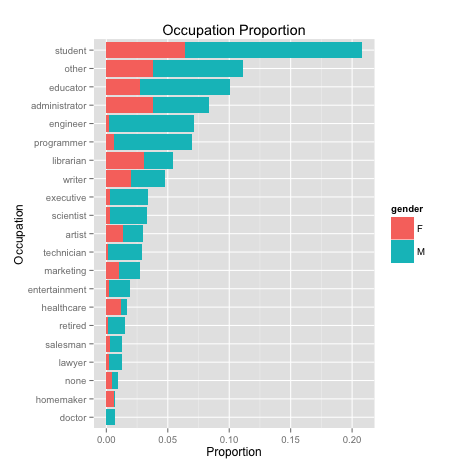
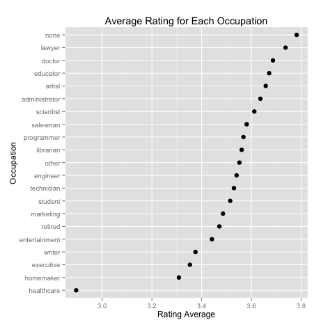
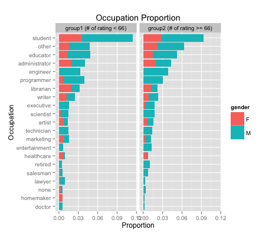

MovieLens Dataset Study - Exploration and Visualization
========================================================
author: David, Alex, Michael
date: 03/02/2016

Outline
========================================================

- MovieLens Data Background
- Movie Rating
- User Information
- Movie Genre

MovieLens Data
========================================================
- Collected by the GroupLens Research Project
at the University of Minnesota
- 100,000 ratings (1-5) from 943 users on 1682 movies
- Each user has rated at least 20 movies
- Demographic info for the users (age, gender, occupation, zip)
- 19 genres to characterize the movie (Action, Comedy, Horror, ...)

Number of Rated Movies per User
========================================================
The distribution of number of movies one user rated is highly right skewed with a long tail. 
The median number of movies one user rated is 65. (Used to divide the group)

User Information
========================================================

***

After Group Division
========================================================

***

Movie Genre
========================================================
- Multi-genres associated with one film. The exact distribution is (833, 569, 215, 51, 11, 3), for number of labels = 1, 2, ..., 6
- Rating of "fun" genres like Action, Horror and Family is very low, while "serious" genres like Drama, Documentary and War are very highly rated given the variation of different number of movies for each genre.

Movie Genre
========================================================

========================================================
incremental: true
   
## Questions?
 
## Thank you!
